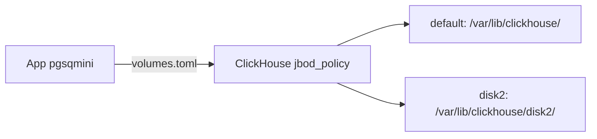

# Requirements

### Overview & Goals
Migrate the storage architecture to use the native ClickHouse `jbod_policy` for improved reliability and performance. This involves removing the custom `DecentralizedCoordinator` and leveraging ClickHouse's built-in volume management.

### Scope
- **In Scope**:
  - Define disk paths in `volumes.toml`.
  - Configure ClickHouse `storage_configuration` in `config.d/storage.xml`.
  - Update all ClickHouse queries to use `SETTINGS storage_policy = 'jbod_policy'`.
  - Remove references to `DecentralizedCoordinator` and `dataset_coordination` table logic.
- **Out of Scope**:
  - UI changes or unrelated business logic.

# Technical Design

### Current Implementation
The system currently uses a custom `DecentralizedCoordinator` (with references but no file found) for data routing, binding entries to specific ClickHouse nodes/disks.

### Key Decisions
- **Transition to ClickHouse Native JBOD**: Using `storage_configuration` for robust disk management instead of application-level coordination.
- **`volumes.toml` Configuration**: Centralizing disk path definitions for flexible deployment.
- **Removal of `DecentralizedCoordinator`**: Simplifying the architecture by relying on ClickHouse's native capabilities.

### Proposed Changes
- **ClickHouse Storage**: Add `config.d/storage.xml` with `jbod_policy`.
- **Configuration**: Create `volumes.toml` and update `src/servers/config.ts` to load it.
- **Queries**: Update `src/query/sources/clickHouse.ts` to enforce `SETTINGS storage_policy = 'jbod_policy'`.
- **Cleanup**: Remove `DecentralizedCoordinator` references from `src/query/dataserver.ts` and `src/servers/migration.ts`. Remove `dataset_coordination` table initialization in `src/servers/migration.ts`.

### Architecture Diagram

# Testing

### Validation Approach
- Verify ClickHouse receives the correct `storage_configuration` from `config.d/storage.xml`.
- Ensure all queries initiated by the application include `SETTINGS storage_policy = 'jbod_policy'`.
- Confirm that `DecentralizedCoordinator` and `dataset_coordination` table references are completely removed from the code.
- Run existing tests to ensure no regressions in basic ClickHouse functionality.

# Delivery Steps

### ✓ Step 1: Configure ClickHouse storage and volumes
Setup storage configuration and volumes.
- Create `volumes.toml` to define `default` and `disk2` paths.
- Add `config.d/storage.xml` defining the `jbod_policy` for ClickHouse.
- Update `src/servers/config.ts` to load `volumes.toml` and make disk configuration available to the application.

### * Step 2: Refactor queries and remove coordinator
Update queries and remove coordinator references.
- Modify `src/query/sources/clickHouse.ts` to append `SETTINGS storage_policy = 'jbod_policy';` to queries.
- Remove stale `DecentralizedCoordinator` imports/usage from `src/query/dataserver.ts` and `src/servers/migration.ts`.
- Update `src/servers/migration.ts` to remove logic related to `dataset_coordination` table initialization/sync.