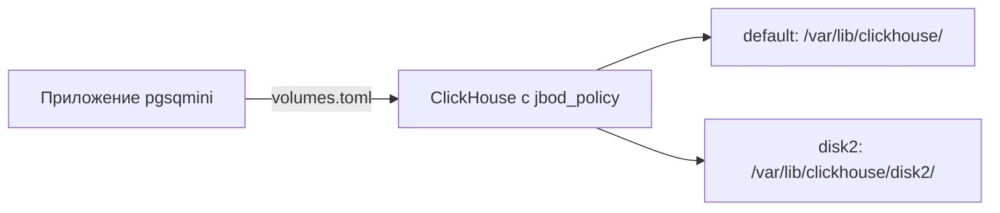

# Requirements

### Overview & Goals
Целью данного технического задания (ТЗ) является миграция архитектуры системы хранения данных с многодисковой схемы под управлением внешнего координатора на единую JBOD-политику (`jbod_policy`) непосредственно в ClickHouse. Конфигурация путей дисков выносится в файл `volumes.toml`, а компонент координатора удаляется за ненадобностью.

### Scope
- **In Scope**:
  - Описание путей дисков (`default` и `disk2`) в конфигурационном файле `volumes.toml`.
  - Настройка XML-конфигурации ClickHouse для поддержки `<storage_configuration>` с дисками и `<jbod_policy>`.
  - Корректировка всех запросов к ClickHouse с добавлением `SETTINGS storage_policy = 'jbod_policy';`.
  - Полное удаление децентрализованного координатора (`DecentralizedCoordinator`, таблица `dataset_coordination` и связанные вызовы).
- **Out of Scope**:
  - Изменение пользовательского интерфейса (UI) и бизнес-логики, не связанной со структурой хранения данных.

### Functional Requirements
1. **Динамическая конфигурация путей**: Пути к дискам должны определяться в файле `volumes.toml` и учитываться при настройке окружения.
2. **JBOD Storage Policy**: ClickHouse должен быть сконфигурирован с политикой `jbod_policy`, объединяющей диски `default` и `disk2` в общий volume `main`.
3. **Использование storage_policy в запросах**: Все операции создания таблиц и вставки/выборки данных должны явно или неявно использовать `SETTINGS storage_policy = 'jbod_policy';`.
4. **Удаление координатора**: Код класса `DecentralizedCoordinator` и проверки шардирования через `dataset_coordination` должны быть удалены, упрощая архитектуру системы до нативной работы ClickHouse с вольюмами.

# Technical Design

### Current Implementation
В текущей архитектуре система работает с двумя дисками через кастомный децентрализованный координатор (`src/query/coordinator.ts`), который использует таблицу `dataset_coordination` (Engine = EmbeddedRocksDB) для маршрутизации и привязки записей к конкретным узлам/дискам.

### Key Decisions
- **Переход на встроенный JBOD ClickHouse**: Вместо ручной координации на уровне приложения используется стандартный механизм `storage_configuration` и `jbod_policy` в ClickHouse, что повышает надежность и производительность.
- **Конфигурация через `volumes.toml`**: Пути к дискам (`default` и `disk2`) выносятся в конфигурационный файл `volumes.toml`, обеспечивая гибкость развертывания.
- **Удаление `DecentralizedCoordinator`**: Полное исключение слоя координации данных, так как распределение по дискам вольюма `main` теперь полностью контролируется движком ClickHouse.

### Proposed Changes
1. **Конфигурация ClickHouse Storage**:
   Добавить XML-конфигурацию хранилища:
   ```xml
   <clickhouse>
       <storage_configuration>
           <disks>
               <!-- Основной первый диск -->
               <default>
                   <path>/var/lib/clickhouse/</path>
               </default>
               <!-- Наш второй новый диск -->
               <disk2>
                   <path>/var/lib/clickhouse/disk2/</path>
               </disk2>
           </disks>

           <policies>
               <!-- Создаем единую политику jbod_policy -->
               <jbod_policy>
                   <volumes>
                       <main>
                           <!-- Перечисляем оба диска в одном volume -->
                           <disk>default</disk>
                           <disk>disk2</disk>
                       </main>
                   </volumes>
               </jbod_policy>
           </policies>
       </storage_configuration>
   </clickhouse>
   ```
2. **Файл `volumes.toml`**:
   Создать файл конфигурации путей дисков для интеграции с инициализацией серверов.
3. **Модификация запросов**:
   В классе `ClickHouseSource` (`src/query/sources/clickHouse.ts`) и при создании таблиц добавить применение `SETTINGS storage_policy = 'jbod_policy';`.
4. **Очистка кодовой базы**:
   Удалить файл `src/query/coordinator.ts` и все ссылки на него.

### Architecture Diagram


### Risks & Mitigations
- **Риск совместимости существующих таблиц**: Таблицы, созданные без указания `storage_policy`, не используют новый volume.
- **Митигация**: Добавить в ТЗ требование указывать `SETTINGS storage_policy = 'jbod_policy'` при создании таблиц и миграциях.

# Delivery Steps

### * Step 1: Настройка конфигурации дисков и volumes.toml
Конфигурация дисков и политик в ClickHouse и приложении описана и готова к работе.
- Создать файл `volumes.toml` с описанием путей к дискам (`default` и `disk2`).
- Добавить XML-конфигурацию ClickHouse (`config.d/storage.xml`) с секцией `<storage_configuration>`, описывающей диски и политику `<jbod_policy>` с вольюмом `main`.
- Реализовать парсер и загрузчик `volumes.toml` в конфигурационном модуле проекта (`src/servers/config.ts`).

###   Step 2: Обновление запросов под storage_policy и удаление координатора
Запросы используют JBOD-политику, а децентрализованный координатор полностью удален.
- Модифицировать выполнение запросов ClickHouse (в `src/query/sources/clickHouse.ts`) для автоматического применения `SETTINGS storage_policy = 'jbod_policy';`.
- Удалить файл `src/query/coordinator.ts` и убрать все импорты и вызовы `DecentralizedCoordinator` из кодовой базы.
- Обновить сервисы миграции и инициализации (`src/servers/migration.ts`, `index.ts`) для работы без таблицы `dataset_coordination`.